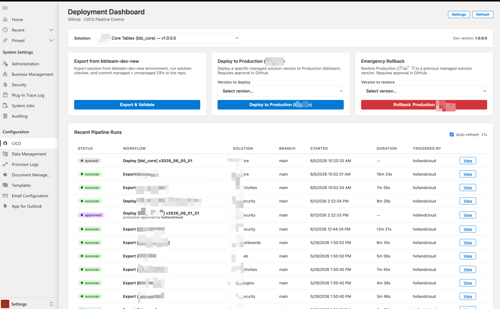
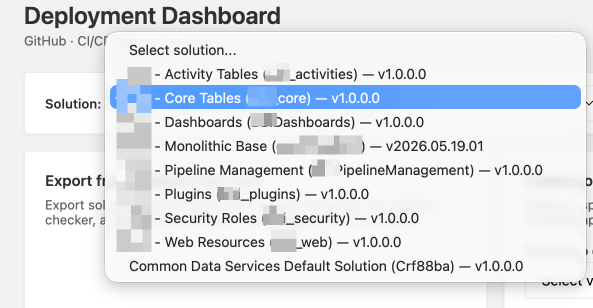
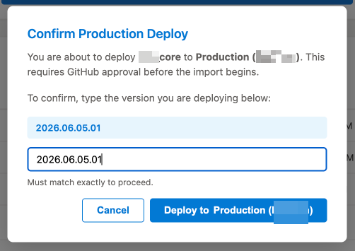
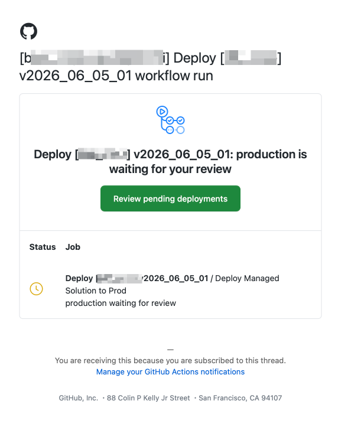

# Power Platform Deployment Dashboard

A self-contained ALM control panel for Power Platform / Dataverse solutions. A single
HTML web resource drives three GitHub Actions pipelines — **Export & Validate**,
**Deploy**, and **Emergency Rollback** — and shows live run/approval status, all from
inside the model-driven app (or any browser).

Deploy to **as many destination environments as you want** — Dev → Test → Staging → Prod,
or a separate environment per client tenant — each with its own GitHub approval gate.

```
  Model-driven app (or browser)            GitHub                         Dataverse
 ┌───────────────────────────┐  dispatch ┌──────────────────┐  pac    ┌───────────────┐
 │ cx_html_deploydashboard   │ ────────► │ export-and-...    │ ──────► │ Dev (source)  │
 │  • pick solution          │  (REST)   │ deploy-to-prod    │ ──────► │ Test          │
 │  • pick destination       │           │ rollback          │ ──────► │ Staging       │
 │  • Export / Deploy / Roll │ ◄──────── │ per-env approval  │ ──────► │ Prod / Client │
 │  • live runs + approvals  │  status   └──────────────────┘         └───────────────┘
 └───────────────────────────┘
```

## Screenshots

| | |
|---|---|
| **Dashboard** — pick a solution, choose a destination, fire any pipeline; live run + approval status below. | **Solution picker** — auto-discovered from Dataverse (or scanned from the repo). |
|  |  |
| **Deploy confirmation** — type the exact version to arm the button; the destination is shown in the dialog. | **Approval gate** — GitHub pauses the run on the destination's environment and emails reviewers. |
|  |  |

## Heads-up: this repo is a distribution template

The workflows in this repo live under **[`examples/workflows/`](examples/workflows/)**, *not*
`.github/workflows/`, so GitHub does **not** register or run them here. To use them, **copy
the three files into `.github/workflows/` in your own deployment repo** (keep the filenames —
the dashboard triggers them by filename). See **[docs/SETUP.md](docs/SETUP.md)**.

## What's in here

```
.
├── webresource/
│   └── cx_html_deploydashboard.html   The dashboard (one file, no build step)
├── examples/workflows/                 EXAMPLE pipelines — copy into .github/workflows/
│   ├── export-and-validate.yml         Export from source → solution checker → commit ZIPs
│   ├── deploy-to-prod.yml              Import managed ZIP to a destination (approval-gated) → release
│   └── rollback.yml                    Restore a previous managed ZIP to a destination (approval-gated)
├── Scripts/
│   └── patch_activity_views.py         Optional post-deploy fix (see note below)
├── Solutions/                          Pipelines commit/read solution ZIPs here
│   ├── Managed/   Unmanaged/   Backups/   Source/
├── SolutionCheckResults/              Solution-checker output (also uploaded as artifact)
├── screenshots/                       Images used in this README
└── docs/
    ├── SETUP.md                       Full GitHub Actions + service-principal setup
    ├── MULTIPLE-ENVIRONMENTS.md       Add/manage extra deploy destinations
    └── ADD-TO-MODEL-DRIVEN-APP.md     Make the dashboard the app's landing page (make.powerapps.com)
```

## How it works

1. The dashboard is a **WebResourceType 1 (HTML)** web resource. It talks to the GitHub
   REST API with a Personal Access Token you paste into **Settings** (stored only in your
   browser's `localStorage`).
2. **Export & Validate** exports the chosen solution from your **source** environment, runs
   the PAC solution checker, and commits the managed + unmanaged ZIPs back to the repo under
   `Solutions/`.
3. **Deploy** imports the selected managed ZIP into the **destination** you pick. The workflow
   runs through a GitHub **Environment** (the destination's approval gate), so it pauses for
   approval before importing.
4. **Rollback** re-imports an earlier managed ZIP to a chosen destination. Also approval-gated.
5. The dashboard lists recent runs, interleaves approval events, and links straight to the
   GitHub approval screen.

## Multiple deploy destinations

You are not limited to a single "Prod". Add destinations in the dashboard's **Settings →
Deploy Destinations** — each has a display name, a Dataverse URL, an optional PAC auth index,
and a **GitHub Environment** name that acts as its approval gate. The Deploy and Rollback
cards each get a **Destination** dropdown.

- **Same tenant** (Dev → Test → Staging → Prod): just add the destination — **no new secrets
  needed**. The dashboard sends the target URL with each run; the shared service principal
  authenticates everywhere it's an application user.
- **Different tenant** (e.g. a per-client production): create a matching **GitHub Environment**
  with its own scoped secrets (that tenant's service principal + URL).

Full walkthrough: **[docs/MULTIPLE-ENVIRONMENTS.md](docs/MULTIPLE-ENVIRONMENTS.md)**.

## Quick start

1. Push this folder to a new GitHub repo, then **copy `examples/workflows/*.yml` into
   `.github/workflows/`** (they must live there on the **default branch** to be dispatchable).
2. Follow **[docs/SETUP.md](docs/SETUP.md)** — register a service principal, add it as an
   application user in your source **and** each destination, set the repo secrets, and create
   a GitHub Environment per destination (the approval gates).
3. Upload `webresource/cx_html_deploydashboard.html` as a web resource in your Dataverse
   solution and **Publish**.
4. Open the dashboard, click **Settings**, and fill in: GitHub PAT, repo (`owner/repo`),
   the source environment, and one or more destinations. Click **Sync Secrets to GitHub** to
   push the service-principal secrets automatically (or set them by hand — see SETUP.md).
5. Optionally make it the app's landing page — see
   **[docs/ADD-TO-MODEL-DRIVEN-APP.md](docs/ADD-TO-MODEL-DRIVEN-APP.md)**.

## Can it auto-deploy itself?

**Partly.** The dashboard's **Sync Secrets to GitHub** button writes the repo secrets for you
over the GitHub API (`PP_CLIENT_ID`, `PP_CLIENT_SECRET`, `PP_TENANT_ID`, `DEV_ENV_URL`,
`PROD_ENV_URL`), so you don't have to paste those into the GitHub UI.

These steps **cannot** be automated and are covered in [docs/SETUP.md](docs/SETUP.md):

- Registering the Entra ID app (service principal) and creating its client secret.
- Adding that app as an **application user** in each Dataverse environment with a security role.
- Creating a GitHub **Environment** per destination and its required reviewers (the approval gate).
- Issuing the GitHub **PAT** the dashboard uses.

## Configuration (all editable in the dashboard's Settings panel)

| Field | Purpose | Default in the shipped file |
|-------|---------|------------------------------|
| GitHub PAT | Trigger workflows + sync secrets | _(empty — you provide)_ |
| Repository | `owner/repo` the workflows live in | `hollandcloud/primarysolution` — **change this** |
| Default solution | Used when the picker can't load | `primarysolution` |
| Export Source URL + name | Where Export pulls *from* (synced as `DEV_ENV_URL`) | `hollandcloud-dev.crm.dynamics.com` |
| Deploy Destinations | One or more targets — name, URL, GitHub Environment, PAC index | one `Production` destination |
| PAC auth index | Optional `pac auth select --index` per env | source `8`, destinations blank |

The defaults above are placeholders; change them in Settings (they persist per-browser) or
edit the `defaults` object near the top of the `<script>` block in the HTML.

## Note on `Scripts/patch_activity_views.py`

The three workflows call this script **only** when the solution name contains `activities`
or equals `hollandcloud_core` — an optional post-deploy fix that filters orphaned
`activitypointer` typecodes out of system views. For any other solution the step is skipped,
so it's harmless to keep. Delete the script and the `Patch Activity Views` steps (or change
the `if:` gate) if you don't need it.

## Caveats worth knowing

- **Rollback reads from `Solutions/Backups/`**, while Export/Deploy use `Solutions/Managed/`.
  Copy the managed ZIP you want to restore into `Solutions/Backups/` (or change the path in
  `rollback.yml`) before using rollback.
- **Approval environments** require a GitHub plan that supports protected environments
  (any plan for public repos; Pro/Team/Enterprise for private repos). A destination whose
  GitHub Environment doesn't exist still deploys, but **with no approval gate** — create it.
- The dashboard auto-discovers solutions from Dataverse when embedded in the app (via
  `Xrm.WebApi`); in a plain browser it falls back to scanning `Solutions/Managed/` in the repo.
</content>
</invoke>
